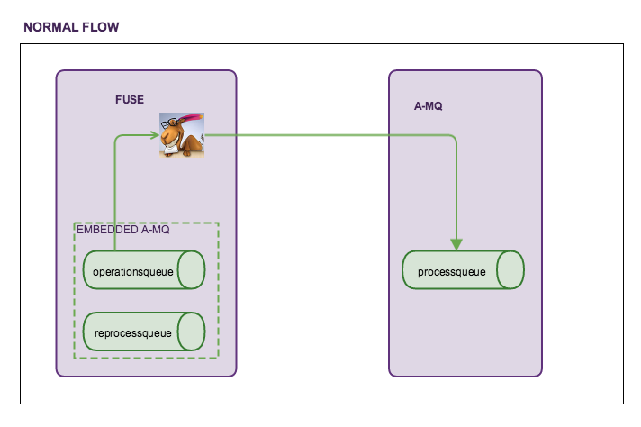
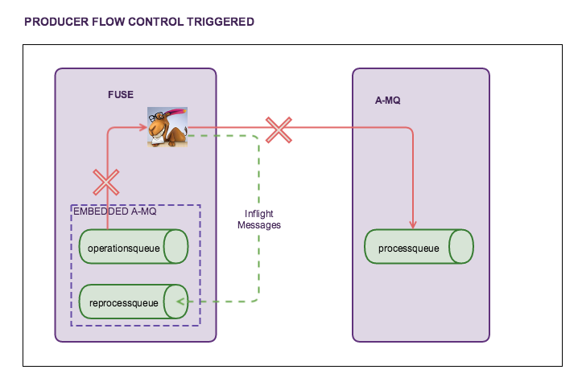

## Stopping a route based on an A-MQ ProducerFlow Exception
 This project demonstrates a Camel route that stops itself when A-MQ turns on Producer Flow Control.

### Important Note -
I have done a few manual tests on it, and they resulted in no message losses. Please run a few of your own tests to make sure that is the case, if it's important for your particular use case.

For testing this setup, the configuration used was:

* JBoss Fuse 6.1 (with embedded A-MQ)
* JBoss A-MQ 6.1 (to initiate Producer Flow Control on a remote broker)

### Installation and Testing -

 * Edit the config file in `src/resources/etc/nz.section6.config.properties` to point to the embedded and remote broker
 * Use `mvn clean install` to create the bundle for deployment
 * Set up ProducerFlowControl on standalone A-MQ to a very low threshold (1-20kb) and don't forget to use [vmQueueCursor](http://activemq.apache.org/producer-flow-control.html)
 * Use the `sendFailIfNoSpaceAfterTimeout` attribute in A-MQ to send back an error to the client when memory usage goes above the low threshold
 * Start up JBoss Fuse and install the current bundle using `install -s mvn:nz.section6.fuse/fuse-amq/1.0-SNAPSHOT`
 * Run the A-MQ extras sendmessages with about 10 messages.
 * Note that the `fuseToAmq` route will stop when Producer Flow Control is triggered

### Pictorial representation of flow

